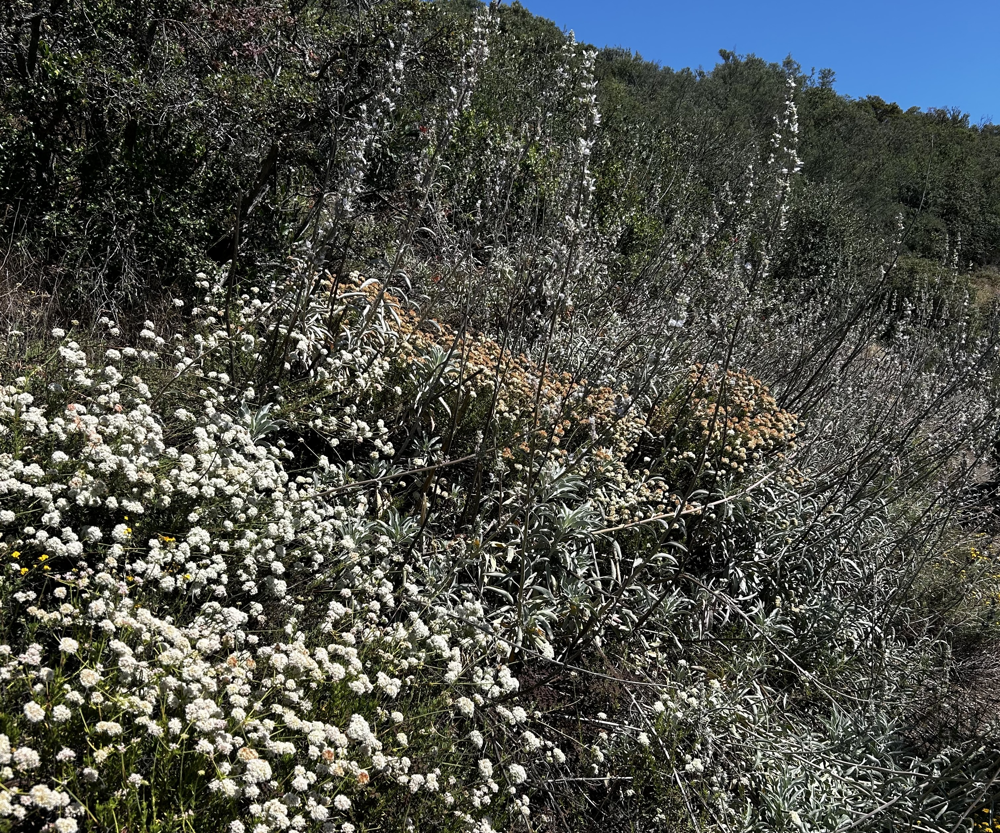

{fig-alt="A photo of plants (buckwheat, sage) in the backcountry of Santa Barbara. The sage towers over the buckwheat. Blue sky can be seen in the background." fig-align="center" width="80%"}

## Instructional team

:::: {.columns}

::: {.column width="50%"}
{fig-align="center" width="80%"}
:::

::: {.column width="50%"}
**Name:** An Bui (she/her)  
**Forms of address:** An (preferred), Dr. Bui, Professor Bui  
**Email:** an_bui [at] ucsb [dot] edu  
**Drop-in hours:** Thursdays 9:30 - 11:30 AM  
**Drop-in location:** At the tables outside the UCen 1st floor (facing the lagoon)  
**More about me:** [an-bui.com](https://an-bui.com/) 
:::

::::

:::: {.columns}

::: {.column width="50%"}

{fig-align="center" width="80%"}
:::

::: {.column width="50%"}
**Name:** Linda Herrera  
**Forms of address:** Linda  
**Drop-in hours:** TBD  
**Drop-in location:** TBD  
**More about me:** TBD
:::

::::
