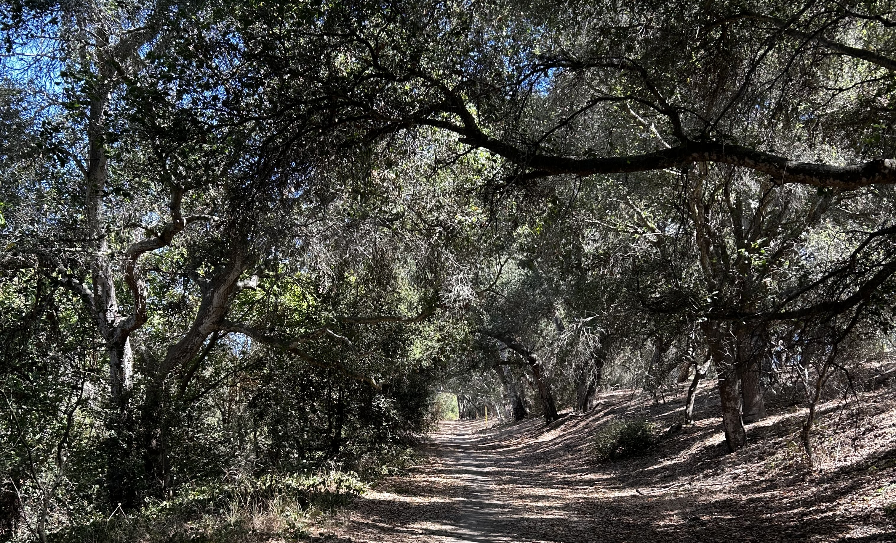
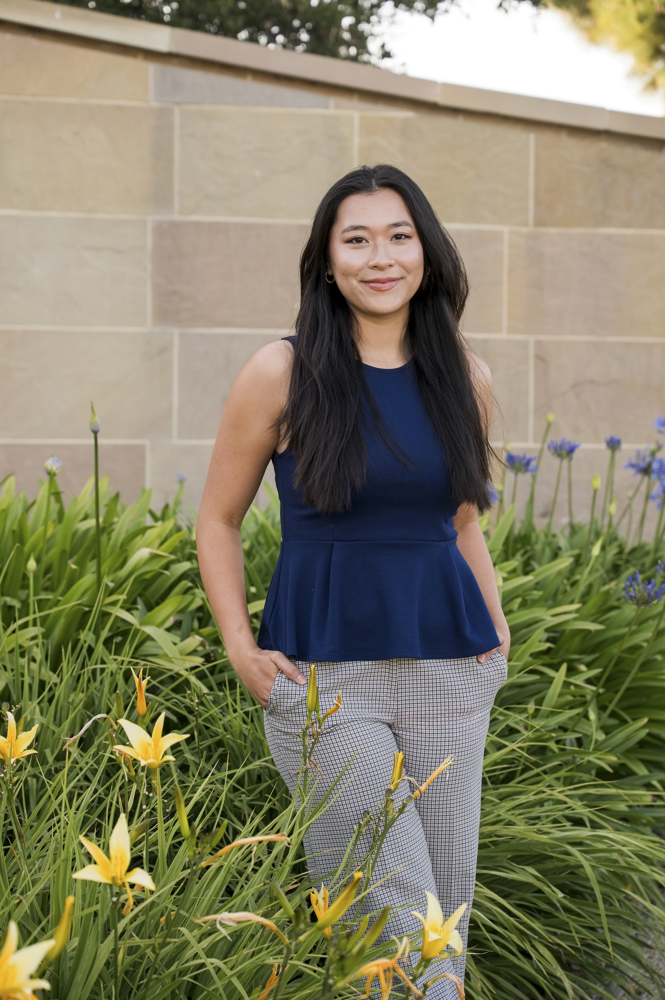

{fig-alt="Coast live oak trees form an arched canopy over a trail. The light streams through the trees. The ground is covered in leaf litter." fig-align="center" width="90%"}

## Instructional team

:::: {.columns}

::: {.column width="50%"}
{fig-align="center" width="80%"}
:::

::: {.column width="50%"}
**Professor:** An Bui (she/her)  
**Forms of address:** An (preferred), Dr. Bui, Professor Bui  
**Email:** an_bui [at] ucsb [dot] edu  
**Drop-in hours:** Mondays 10:00-11:30 AM  
**Drop-in location:** At the tables outside the UCen 1st floor (facing the lagoon)  
**More about me:** [an-bui.com](https://an-bui.com/) 
:::

::::

:::: {.columns}

::: {.column width="50%"}

{fig-align="center" width="80%"}
:::

::: {.column width="50%"}
**Undergraduate learning assistant:** Linda Herrera (she/her)  
**Forms of address:** Linda  
**Drop-in hours:** Wednesdays 11:00 AM - 12:00 PM  
**Drop-in location:** At the tables outside the UCen 1st floor (facing the lagoon)     
**More about me:** TBD
:::

::::
